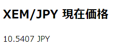

-   [nemlog 記事とプロフィール](https://nemlog.nem.social/profile/5648)
-   [サンプルコード index.html](./index.html)
-   [Home に戻る](/README.md)

# 簡単プログラミング！XEMの現在価格を表示しよう

みなさん、こんにちは。

簡単だけど、ちょこっと役に立つプログラムを作っていきましょう。シリーズ化を予定しています。

このシリーズでは、コードの詳細を掘り下げるのではなく、「こんな風に書けば役に立つプログラムが書けるよ」ということを紹介していく予定です。

今回のプログラムでは、Zaif取引所のAPIを通してXemの現在価格を取得して表示してみます。なお、ブラウザはGoogle Chromeを使用し、プログラミング言語はJavaScriptを使用します。

ちなみに、APIとは何か？ということを次のリンク先を読んで理解してください。実際のアプリケーション開発において、APIを使用しないケースはほとんどないと思いますので、概念の理解は必須です。まあ簡単に言えば、自社サービスの機能をプログラムから手軽に使ってもらうための仕組みです。YouTubeをはじめほとんどの有名なサービスでAPIを提供しています。

https://www.sejuku.net/blog/7087

Zaifにおいても、暗号資産に関するさまざまな機能をAPIとして提供していますが、今回はティッカーと呼ばれる通貨ペア（XEM/JPY、BTC/JPYなど）の最低限の売買情報を取得し、その中から最新（最終）価格を取り出してブラウザに表示してみます。

では、次のURLにアクセスしてみてください。

https://api.zaif.jp/api/1/ticker/xem_jpy

次のような内容が表示されたと思います。

> {"last": 10.4251, "high": 10.65, "low": 10.1503, "vwap": 10.4325, "volume": 19248910.0, "bid": 10.4339, "ask": 10.4598}

ブラウザでREST APIと呼ばれる方式でAPIにアクセスし、結果をJSONというデータ形式で受け取っています。JSONについて関連リンクを参照してください。

「"last": 10.4251」という部分がXEMの最終（現在）価格です。

ということで、今回作るプログラムは

ティッカー情報を返すZaifのREST APIにアクセスする。
JSON形式で取得したティッカー情報の中から、最終価格を取り出す。
取り出した最終価格を表示する。

という流れになります。

プログラム全体の内容は次の通りです。

```html
<!DOCTYPE html>
<html lang="ja">
    <head>
        <meta charset="UTF-8" />
        <meta name="viewport" content="width=device-width, initial-scale=1.0" />
        <script
            type="text/javascript"
            src="https://cdn.jsdelivr.net/npm/ccxt@1.37.14/dist/ccxt.browser.js"
        ></script>
        <title>XEM現在価格</title>
        <script>
            document.addEventListener('DOMContentLoaded', function () {
                // スタート直後にアラートを表示し、OKボタンをクリックすると、ティッカー情報を取得します。
                alert(
                    'XEMの現在価格を取得します。10秒間内に取得できないとタイムアウトエラーが発生します。'
                );

                const proxy = 'https://cors-anywhere.herokuapp.com/'; // CORS対策（CORSについては奥がそのうち別途説明する予定）。
                const zaif = new ccxt.zaif({ proxy: proxy }); // ZaifのAPIにアクセスする準備。
                const symbol = 'XEM/JPY'; // 通貨ペア。

                zaif.fetchTicker(symbol) // 通貨ペアのティッカー情報を取得します。
                    .then((ticker) => {
                        // ティッカー情報が正常に取得できた場合。
                        const text = [JSON.stringify(ticker['close']), 'JPY']; // 現在価格を取り出します。
                        document.getElementById(
                            'content'
                        ).innerHTML = text.join(' '); // 表示内容をセットします。
                    })
                    .catch((e) => {
                        // エラーが発生した場合。
                        const text = [e.constructor.name, e.message];
                        document.getElementById(
                            'content'
                        ).innerHTML = text.join(' ');
                    });
            });
        </script>
    </head>
    <body>
        <h2>XEM/JPY 現在価格</h2>
        <!-- 現在価格を取得したら、ここに表示します。 -->
        <div id="content">取得中...</div>
    </body>
</html>
```

上記のコードを任意の場所にticker.htmlなどと保存し、ブラウザで実行すると、次のような結果が表示されるはずです。



ときどき、

RequestTimeout zaif GET https://cors-anywhere.herokuapp.com/https://api.zaif.jp/api/1/currency_pairs/all request timed out (10000 ms)

というタイムアウトエラーが発生しても気にしなくてよいです。

重要なポイントは次の個所で、ティッカー情報がticker変数に格納されるので、ticker["close"]で現在価格を取り出しています。

.catch() で囲まれた箇所はエラーが発生した場合の処理内容で、エラー内容をそのまま表示するようにしています。

```javascript
zaif.fetchTicker(symbol) // 通貨ペアのティッカー情報を取得します。
    .then((ticker) => {
        // ティッカー情報が正常に取得できた場合。
        const text = [JSON.stringify(ticker['close']), 'JPY']; // 現在価格を取り出します。
        document.getElementById('content').innerHTML = text.join(' '); // 表示内容をセットします。
    })
    .catch((e) => {
        // エラーが発生した場合。
        const text = [e.constructor.name, e.message];
        document.getElementById('content').innerHTML = text.join(' ');
    });
```

たったこれだけの記述で済んでしまうには理由があります。次の個所で、ZaifのRESTAPIに簡単にアクセスできるライブラリを読み込んでいるからです。

```html
<script
    type="text/javascript"
    src="https://cdn.jsdelivr.net/npm/ccxt@1.37.14/dist/ccxt.browser.js"
></script>
```

CCXTはさまざまな取引所のAPIを簡単に扱える便利機能を提供してくれています。

このライブラリがなかった場合は、

-   HTTPヘッダーに最低限定められた情報をセットし、
-   HTTP GET方式でAPIにリクエストを発行し、
-   HTTPレスポンスを受け取り、そのレスポンス内容から、対象のデータ（今回の場合はティッカー情報）を取り出します。
-   そして、HTTPレスポンスのステータスコードがエラーを示すコード（たとえば、404や500など）だった場合は、エラーに対応する処理を行う。

という、結構面倒なことを行うコードを書かなくてはならず、コード量もライブラリを使用しなかった場合の2倍以上になります。

HTTPレスポンスとライブラリについては関連リンク先の内容を参照してみてください。わかりやすいのを選択したつもりではあります。

いかがでしたでしょうか？

非常にシンプルなプログラムではありますが、深く追求していくと、いろんな知識が必要だということがご理解いただけるかと思います。しかし、ビビる必要はありません。わからない時はググればいいのです。

ただ、どういうキーワードでググればいいのか？何を調べればいいのか？については、コツをつかむまで慣れが必要かと思います。

今回はHTMLファイルの中にコードを書いてその結果をブラウザに表示しましたが、Node.jsというサーバーサイドでJavaScriptを実行させる仕組みを使って、ターミナル（黒い画面）上でプログラムを動作させ、結果を表示することもできます。

次回以降では、今回と同じ方式で複数の取引所のXEMの最新価格を表示するプログラムや、Node.jsを使った方式でのプログラムを紹介していきたいと思います。

同じような内容のプログラムに機能を付け加えたり、違う方法で記述してみることで理解が深まっていくのでは？と思ってます。

私はほぼバックエンドエンジニアなので、JavaScriptやHTML、CSSは苦手なのですが、一緒に頑張っていきましょう！

そのうち、JavaScriptに静的型システムを導入したTypeScriptで書き直した場合も示したいと思います。

TypeScriptについて知りたい方は、こちらもちらっと見ておくとよいかもしれません。

https://udemy.benesse.co.jp/development/web/typescript.html

コードの提供、動作確認方法などをGitHubのリポジトリで行う予定なので、もうしばらくお待ちください。

ではまた次回！

p.s. 少しでもためになったと思われましたら、投げ銭お願いします！ モチベーションがアップします！

関連リンク

-   https://zaif-api-document.readthedocs.io/ja/latest/PublicAPI.html#id22
-   http://e-words.jp/w/API.html
-   https://www.sejuku.net/blog/7087
-   http://www.tohoho-web.com/ex/json.html
-   https://developer.mozilla.org/ja/docs/Web/HTTP/Status
-   http://e-words.jp/w/%E3%83%A9%E3%82%A4%E3%83%96%E3%83%A9%E3%83%AA.html
-   https://github.com/ccxt/ccxt
