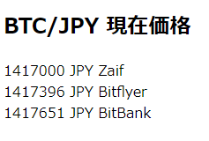

-   [nemlog 記事とプロフィール](https://nemlog.nem.social/profile/51408)
-   [サンプルコード index.html](./index.html)
-   [Home に戻る](/README.md)

# 簡単プログラミング！BTCの複数取引所の現在価格を表示しよう

みなさん、こんにちは。

簡単だけど、ちょこっと役に立つプログラムを作っていくシリーズです。

今回のプログラムでは、前回ご紹介したプログラムコードを少し拡張して、

3つの取引所（Zaif、Bitflyer、BitBank）からBTC/JPY通貨ペアのティッカー情報を取得し、それぞれの現在価格を次のスクリーンショット画像のように表示します。



プログラミングコード全体としては、次のようになります。

```html
<!DOCTYPE html>
<html lang="ja">
    <head>
        <meta charset="UTF-8" />
        <meta name="viewport" content="width=device-width, initial-scale=1.0" />
        <script
            type="text/javascript"
            src="https://cdn.jsdelivr.net/npm/ccxt@1.37.14/dist/ccxt.browser.js"
        ></script>
        <title>BTC現在価格</title>
        <script>
            document.addEventListener('DOMContentLoaded', function () {
                // スタート直後にアラートを表示し、OKボタンをクリックすると、ティッカー情報を取得します。
                alert(
                    '複数の取引所から、BTCの現在価格を取得します。10秒間内に取得できないとタイムアウトエラーが発生します。'
                );

                const proxy = 'https://cors-anywhere.herokuapp.com/'; // CORS対策（CORSについては奥がそのうち別途説明する予定）。
                const zaif = new ccxt.zaif({ proxy: proxy }); // ZaifのAPIにアクセスする準備。
                const bitflyer = new ccxt.bitflyer({ proxy: proxy }); // BitflyerのAPIにアクセスする準備。
                const bitbank = new ccxt.bitbank({ proxy: proxy }); // BitbankのAPIにアクセスする準備。
                const symbol = 'BTC/JPY'; // 通貨ペア。

                zaif.fetchTicker(symbol) // 通貨ペアのティッカー情報を取得します。
                    .then((ticker) => {
                        // ティッカー情報が正常に取得できた場合。
                        const text = [
                            JSON.stringify(ticker['close']),
                            'JPY',
                            'Zaif',
                        ]; // 現在価格を取り出します。
                        document.getElementById(
                            'content_zaif'
                        ).innerHTML = text.join(' '); // 表示内容をセットします。
                    })
                    .catch((e) => {
                        // エラーが発生した場合。
                        const text = [e.constructor.name, e.message];
                        document.getElementById(
                            'content_zaif'
                        ).innerHTML = text.join(' ');
                    });

                bitflyer
                    .fetchTicker(symbol) // 通貨ペアのティッカー情報を取得します。
                    .then((ticker) => {
                        // ティッカー情報が正常に取得できた場合。
                        const text = [
                            JSON.stringify(ticker['close']),
                            'JPY',
                            'Bitflyer',
                        ]; // 現在価格を取り出します。
                        document.getElementById(
                            'content_bf'
                        ).innerHTML = text.join(' '); // 表示内容をセットします。
                    })
                    .catch((e) => {
                        // エラーが発生した場合。
                        const text = [e.constructor.name, e.message];
                        document.getElementById(
                            'content_bf'
                        ).innerHTML = text.join(' ');
                    });

                bitbank
                    .fetchTicker(symbol) // 通貨ペアのティッカー情報を取得します。
                    .then((ticker) => {
                        // ティッカー情報が正常に取得できた場合。
                        const text = [
                            JSON.stringify(ticker['close']),
                            'JPY',
                            'BitBank',
                        ]; // 現在価格を取り出します。
                        document.getElementById(
                            'content_bb'
                        ).innerHTML = text.join(' '); // 表示内容をセットします。
                    })
                    .catch((e) => {
                        // エラーが発生した場合。
                        const text = [e.constructor.name, e.message];
                        document.getElementById(
                            'content_bb'
                        ).innerHTML = text.join(' ');
                    });
            });
        </script>
    </head>
    <body>
        <h2>BTC/JPY 現在価格</h2>
        <!-- 現在価格を取得したら、ここに表示します。 -->
        <div id="content_zaif">Zaifから取得中...</div>
        <div id="content_bf">Bitflyerから取得中...</div>
        <div id="content_bb">BitBankから取得中...</div>
    </body>
</html>
```

変更点は通貨ペアが「XEM/JPY」から「BTC/JPY」になったこと、ティッカー情報を取得する取引所が3つに増えたこと、取得した現在価格を表示する箇所が3つに増えたことです。

CCXTというライブラリを使用していることは前回お伝えしましたが、このライブラリの最大の特徴は何といっても対応している取引所の多さです。CoinCheckにも対応しているので、ぜひコードを書き替えてみてください。

変更の仕方はなんとなくわかると思います。

質問などある場合は、コメント欄でもDMでも結構ですのでお送りください。

本プログラムを動かしてみるとわかりますが、Zaif -> Bitflyer -> BitBankという順序で必ず取得＆表示されていません。ティッカー情報を早く取得した順で表示しているのです。この3つの組み合わせでは、BitBankがだいたい一番早く表示されるようですね。

このように順番通り処理が完了するのを待ってから次に進むのではなく、待たずに次の処理を進めていく処理方式を非同期処理と呼びます。JavaScriptにおいてはこの非同期処理をマスターすることが非常に重要です。

次からは、Node.jsを使って同じように、最新価格を取得して表示するプログラムの書き方などなどを紹介したいと思います。非同期処理についても触れていきます。

さて、本日はこんなところでしょうか。。

湿度が下がると、飛沫の拡散距離が2倍に到達することもあるらしいので、コロナの感染拡大が怖いですね。

湿度が上がるような工夫をしましょう！
