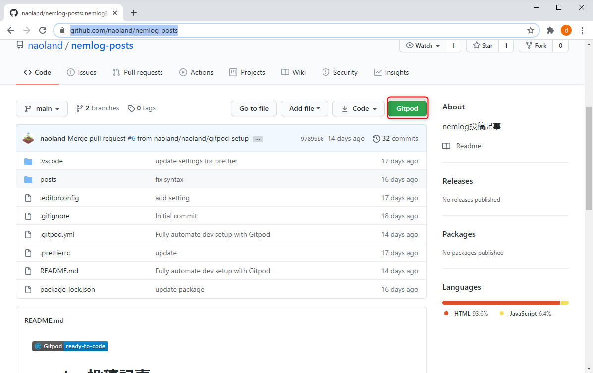
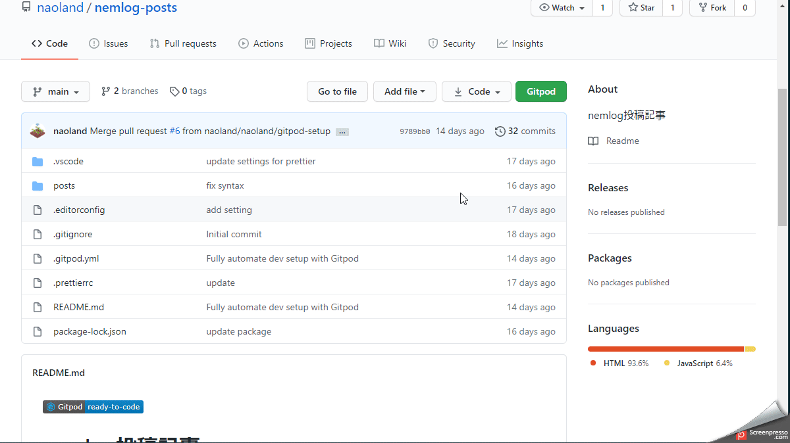
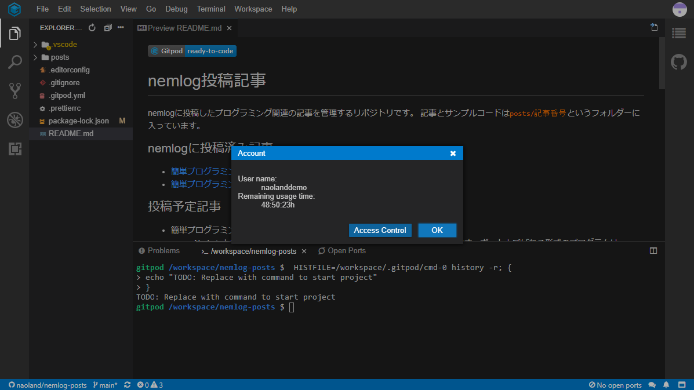
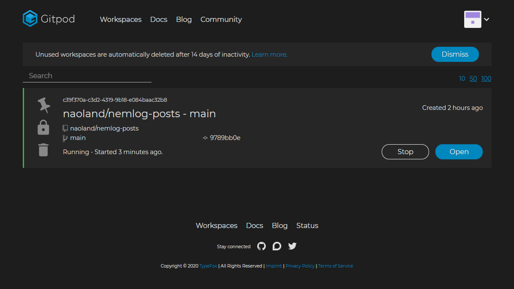
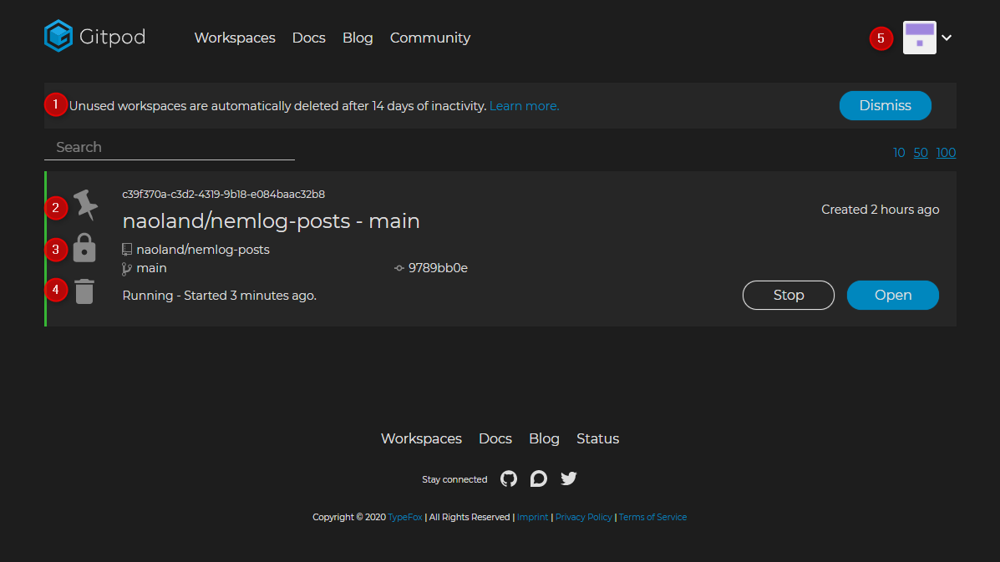

# 開発環境を準備しよう #2 Gitpodを使ってみよう

過去記事リスト

簡単プログラミング！XEMの現在価格を表示しよう
https://nemlog.nem.social/blog/51387

簡単プログラミング！BTCの複数取引所の現在価格を表示しよう
https://nemlog.nem.social/blog/51408

プログラミング関連記事とサンプルコードを閲覧、ダウンロードできる場所を用意しました。
https://nemlog.nem.social/blog/51549

開発環境を構築しよう #1 GitHubアカウント作成
https://nemlog.nem.social/blog_edit/51589

開発環境を準備しよう #2 Gitpodアカウント作成
https://nemlog.nem.social/blog/51600

みなさん、こんにちは。 お元気でしょうか？

私の方はぎっくり腰になったり、両目とも感染症になったりと散々でした。健康には気をつけたいですね。

さて、前回の記事ではGitpodのアカウント作成と、どんな感じで使うのかの雰囲気を感じていただきました。

今回はGitpodの使い方をもう少しくわしく紹介したいと思います。

GitpodはWebIDEとかクラウドIDEと呼ばれており、WEBブラウザ上だけで開発を完結させることを目標としています。類似のサービスとしては、Google Cloud Shellというものがあります。

Gitpodは、「Eclipse Theia」という、「真のオープンソースによるVisual Studio Codeの代替」を目指して開発がすすめられている、オープンソースの統合開発環境をベースにしたサービスです。Theiaに関してはリンク先の情報を参照してください。これらのサービスは「WEB IDE」とか「クラウドIDE」と呼ばれているようです。

GitpodはGitHubのリポジトリ内のコードを編集したり、プログラムを実行できます。
リポジトリというのは、とりあえずファイルのおき場所だと覚えておけば良いと思います。
GitpodはGitHubにリポジトリを作ることができませんので、たとえば、私が公開しているリポジトリだったり、その他のリポジトリを利用することになります。
もちろん、ご自身でGitHubにリポジトリを作成し、Gitpodから利用することが可能です。

まず、こちらにアクセスしてください。 まだGitpodのアカウントを作成していない人は過去記事を参考にアカウントを作成してください。

https://github.com/naoland/nemlog-posts

クロームにGitpodの拡張機能をインストール済みであれば、「Gitpod」というボタンが表示されているはずです。拡張機能をインストールしていない場合は、リンク情報を参考にしてインストールしてください。

「Gitpod」ボタンをクリックしてください。ワークスペースが読み込まれ、利用可能な状態になります。

ワークスペースが表示された状態で右上のアイコンをクリックするとメニューが表示されます。最低必要な項目のみ説明します。

メニューから「Account」を選択すると、ユーザ名と利用可能な残り時間が表示されます。フリープランで利用している場合は、毎月50時間の無料使用時間がもらえます。
一定時間（15分くらい）使用しないと自動的にカウントが停止されますので、十分な時間といえます。

メニューから「Open Workspaces」を選択すると、新しいタブに次のように表示されます。表示されるのはワークスペースの一覧です。

1番から順に説明します。

1. 15日間ほったらかしにして、利用しなかった場合は自動的にワークスペースが削除されます。削除されても作り直せばよいので「Dissmiss」ボタンをクリックしておきましょう。
2. ワークスペースをクリップし、最上位に表示されます。
3. このボタンをクリックして鍵マークを外すと、他の人に自分のワークスペースを見せることができます。 私の記事の中では使用しません。
4. ワークスペースを削除します。ワークスペースを作り直したい、不要になったので削除したい場合にクリックしてください。
5. ワークスペースに関連するメニューを表示します。当面の間使う予定がないので説明を割愛します。

番号をふるのを忘れてしまいましたが、「Open」ボタンをクリックするとワークスペースが開きます。ワークスペースが終了している場合は、このボタンは「Start」と表示されます。

毎回GitHub経由でワークスペースを開くのが面倒な方は、次のリンクをクリックしてください。ワークスペース一覧が表示されます。

https://gitpod.io/workspaces/

ワークスペースの説明

次のような画面が表示されていると思います。Gitpodではワークスペース（workspace）という単位で作業場所が管理されます。

## Links

[Theia](https://theia-ide.org/)

Cloud Shell  |  Google Cloud
https://cloud.google.com/shell?hl=ja

Visual Studio Codeの代替を狙う統合開発環境「Eclipse Theia 1.0」リリース。VS Codeの拡張機能を利用可能、デスクトップ版とWebブラウザ版に両対応  
bit.ly/38OqPCy

Gitpod用のクローム機能拡張  
https://chrome.google.com/webstore/search/gitpod?hl=ja

