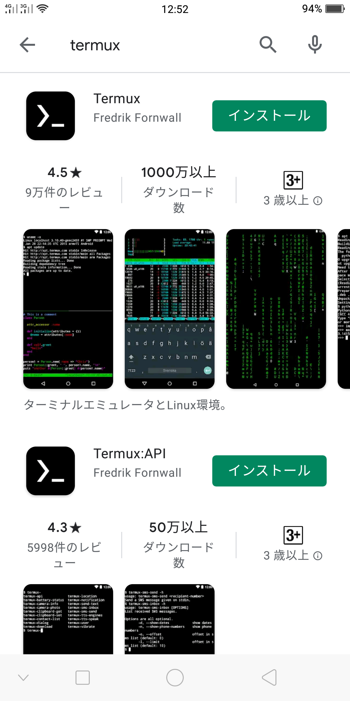
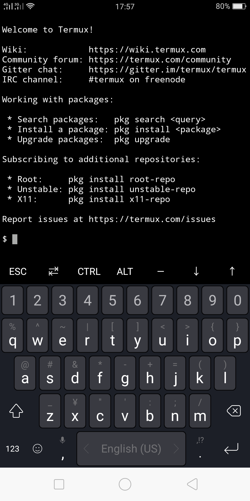
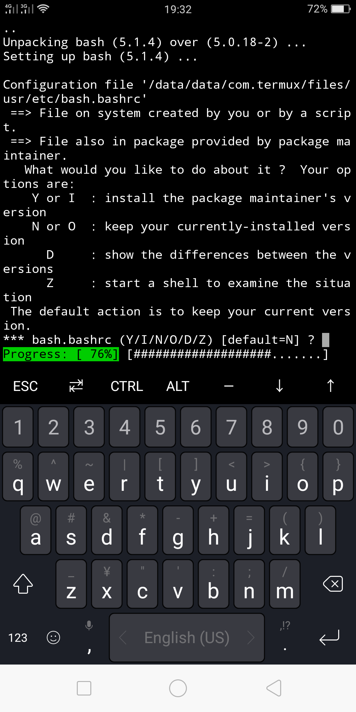

# 【TIPS#1】 アンドロイドスマホにLinuxとPythonを導入してみよう

【Tips#1】

初めに

みなさん、こんにちは。

今回は、Androidスマホに`Linux`を導入し、ついでに`Python`をインストールする方法を紹介します。

読者の対象はLinuxが何であるか知っている方々、アンドロイドスマホをご利用の方限定です。

iOSには原則、LinuxなどmacOS以外のOSをインストールすることができませんが、アンドロイドスマホであれば可能です。

## Termuxとは？

Termuxは、Androidターミナルエミュレーターであり、最小構成のLinux環境アプリです。


では、AndroidスマホにLinuxを導入すると何が嬉しいのでしょうか？

- 導入したLinux環境を壊したとしても、一般的なアプリと同様にアプリを削除し、Google Playからインストールし直すだけです。ただし各種設定はやり直しになります。
それにより、気軽にLinuxをいじることができます。
- Termuxをインストールすると、スマホの内部ストレージやSDカードへアクセスできます。
- 機会としては少ないでしょうが、外出先でPCが利用できない場合に、ターミナルからSSHでサーバーに接続し、コマンドを実行したりできます。
- 予備のLinux環境が手に入る。

ちなみに、`Python`とは、近年非常に人気のあるプログラミング言語です。

それでははじめていきましょう！


## Termuxのインストール

  

普通のアプリと同じ手順でインストールします。
`Termux:API`というのがありますが、これについては別のTIPS記事で紹介しますので、今回はインストールする必要ありません。

`Termux`アプリを起動してみると、次のような画面が表示されると思います。

  

以上で`Termux`のインストールは終了です。

## 環境のセットアップ

### パッケージを更新します。

Termuxのパッケージ管理は原則`pkg`コマンドで行い、`apt`コマンドは使用しません。

`>` はプロンプトですのでタイプしないでください。

```
> pkg upgrade
```

  

途中で質問されることがありますがそのままエンターキーをタイプしてください。

または`N`とタイプしてください。


### Pythonのインストール

次のコマンドを実行してPythonをインストールします。

```
> pkg install -y python
```

次のコマンドを実行して、インストールしたバージョンを確認します。

```
> python -V
```

結果が

`Python 3.9.1` などと表示されればOKです。

## まとめ

今回はアンドロイドスマホに`Termux`というLinuxとターミナル環境をインストールするまでの手順を紹介しました。

ただ、いつもアンドロイドスマホのキーボードと小さな画面上で作業するのはつらいです。

そこで次回は、PCからTermuxをインストールしたアンドロイドスマホにSSH接続するための準備と、PCのVSCodeからTermuxにリモート（SSH）接続して簡単なプログラムを書いて、デバッグを実行するまでの手順を紹介します。


## 関連情報へのリンク

- [公式サイト（英語）](https://termux.com/)
- [Termux Wiki](https://wiki.termux.com/wiki/Main_Page)
- [Termux - Google Play のアプリ](https://play.google.com/store/apps/details?id=com.termux&hl=ja)
